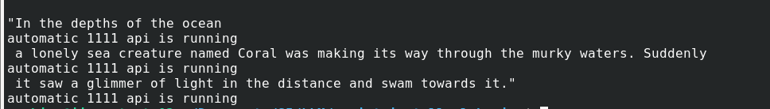
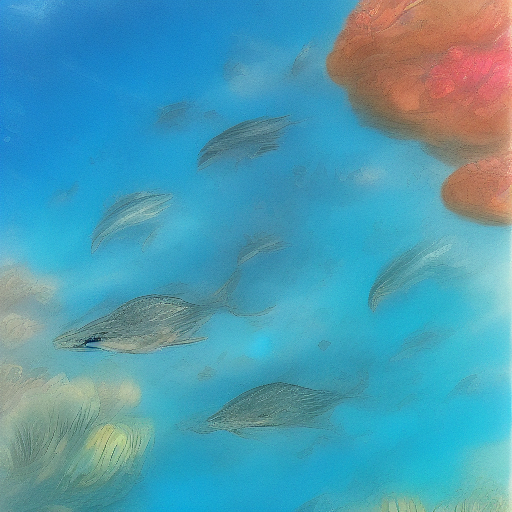
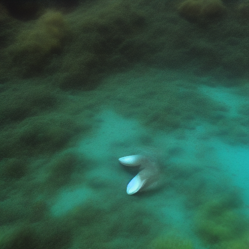
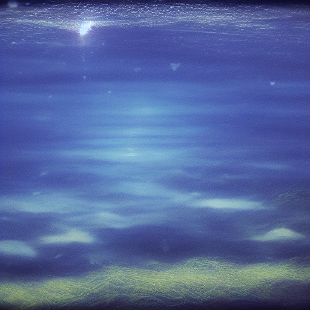
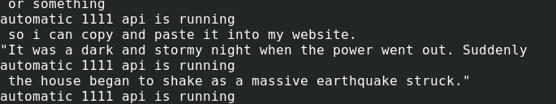
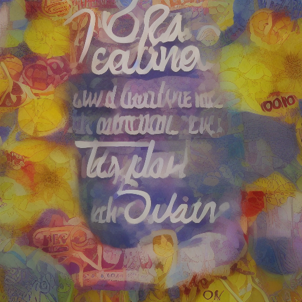
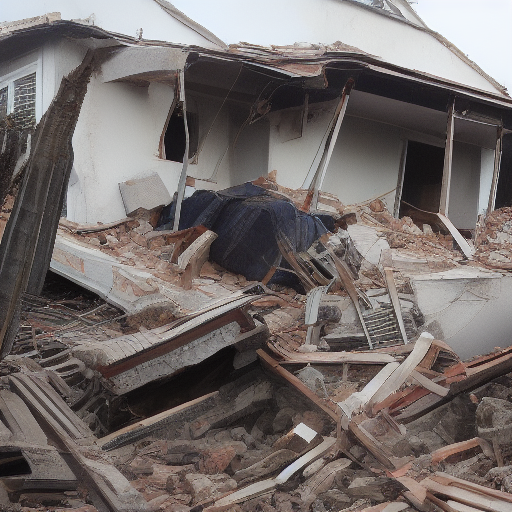

# IAstucieux • 


<<<<<<< HEAD
=======

Python library that allows easy use of AIs like Llama2 and Stable Diffusion and more.
>>>>>>> 3ba7e8965356351562f527b8755841dfe6947a8c


Python library that allows easy use of AIs like Llama2 and Stable Diffusion and more.

### ❓• What is IAstucieux ? 
IAstucieux is a project carried out as part of our 3rd year of IT BUT

## 📃 • Introduction
This library allows the use of Llama2 and Stable Diffusion through the use of "Automatic 1111". We are developing a framework that allows the use of these programs locally.

This project contains also the creation of a toolkit as a library that enables the easy use of some AI models
such as [Llama2](https://github.com/facebookresearch/llama) and [Stable Diffusion](https://github.com/CompVis/stable-diffusion), and that can be extended with additional AI models.<br/>
You will be able to use the models you installed through the library that is being developed here.

This project uses Python *3.9.2*, [Llama2](https://github.com/facebookresearch/llama) and [Stable Diffusion](https://github.com/CompVis/stable-diffusion) are included in the base installation.


## 👨🏿‍👩🏻‍👧🏽‍👦🏾 • Members 
- Charly Flu - Leader of the project and Windows part
- Paolo Hoogland - MacOS part 
- Evguenia Sobine - Linux part 
- Océane Druenne - Linux part 
- Mattéo Tholey - Windows part 
- Sarah Heimburger - Windows part
- Baptiste Saul - Windows part 
- Lucas Grethler - Windows part 
- Isaïe Debèze - Windows part 


## ⚙️ • Installation

### 🪟 • Windows & 🍎 • Mac

To install the different AIs available, open the `installs/manuals` folder at the root of the project then choose the .md files that correspond to your OS. This folder contains all the installation instructions we have done so far for the different OS.

### 🐧 • Linux debian based machine

We heavily advise you to use the `install_llama_a1111_linux.sh` script located in `installs/automatics` from the root of the project.
> /!\ You need python3.9 to use our project !

To use this script you can do it either by running this command : 
```bash
$> ./install_llama_a1111_linux.sh
```
Or if you don't want the .venv to be in the root of the project but somewhere else, you can do :
```bash
$> ./install_llama_a1111_linux.sh ../../../path/to/.venv
```

### ⚠️ • Troubleshooting

Go [here](#issues) if you have any problem.

## 🖥️ • Use our project 

In order to use our library, you must first launch the automatic 1111 API locally on your machine.

> The command to launch the 1111 API on Linux is:

```bash
$> ./webui.sh --skip-torch-cuda-test --precision full --no-half --api
```


When developing your code in Python, you need to import the our lib to be able to use its functions.
To do this, you can check our guide "lib/GUIDE.md", which explains the requirements to do this. There are also some examples of programs that use our lib, so you can understand how to implement it.

It is then possible to configure the language model you wish to use by entering it in the path via the command `set_path_model_lama`, (for more details about the differents command available, you can check the `doc.md` file and the file of the library located in `lib/ia-stucieux.py`).
An empty “models” folder is already present on this git in order to store the different models acquired.

After that, you finally have access to all the functions of our library to develop your application in Python.

It is possible to retrieve the results from the Llama AI and then process them as you wish depending on your needs, for example by continuing with the use of the AI Automatic 1111 where you can pass whatever you want in the prompt.

Here an example of use case for generate comics:
```
import ia_stucieux

def main():
    print("python main function")
    ia = ia_stucieux.ia_stucieux()
    ia.set_path_model_lama("~/mistral-7b-instruct-v0.1.Q5_K_M.gguf")
    ia.set_img_path("~/comics_images")
    ia.set_max_token(140)

    story = ia.askLlama("can you describe me one short comics story about a cat that destroy everything in 3 panels? And only print it in a format like a csv file")
    print(story)
    
    x = story.split(",")
    print(x)

    for index, item in enumerate(x):
        if"".__ne__(item):
            if "panel" not in item:
                print(x[index])
                ia.generateImg(x[index], f'panel{index}')

if __name__ == '__main__':
    main()
```


## 🖼️ • Screenshots 

Here is a little overview of what you get by using our library : 

- Story about a little fish that sees something shining in the water

  

- Story about a house that experiences an earthquake : 

  


## 🆘 • Issues 

- If you have any issue try to use the manual installation scripts in `installs/manuals` if not already done.

- If you encounter some issues during the installation of llama2 or automatic1111, you can check the `HELP.md` file located in `installs/HELP.md`. This file contains a list of different errors that can be encountered with their associated solutions.

- If you have any other issues, please refer to the "issues" page and don't hesitate to create a new topic about your problem.
